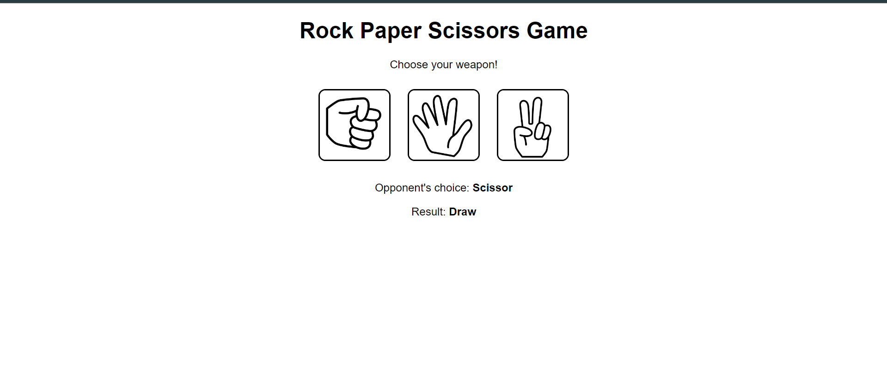

# Rock Paper Scissors Game

This is a simple web-based Rock Paper Scissors game built using Flask. The player can choose between rock, paper, or scissors, and the computer will randomly select one of the three options. The result of the game (win, lose, or draw) will be displayed along with the computer's choice.

## Features

- Play Rock Paper Scissors against the computer.
- Displays the result of the game.
- Alerts the player if they lose.

## How It Works

1. The player selects rock, paper, or scissors by clicking the corresponding button.
2. The computer randomly selects one of the three options.
3. The result of the game is determined based on the player's choice and the computer's choice:
    - Rock beats Scissors
    - Scissors beats Paper
    - Paper beats Rock
    - If both choices are the same, it's a draw.
4. The result and the computer's choice are displayed on the screen.
5. If the player loses, an alert is shown.

## Running the Application

1. **Clone the repository:**
    ```sh
    git clone https://github.com/yourusername/rock-paper-scissors.git
    cd rock-paper-scissors
    ```

2. **Create a virtual environment:**
    ```sh
    python -m venv venv
    ```

3. **Activate the virtual environment:**
    - On Windows:
        ```sh
        venv\Scripts\activate
        ```
    - On macOS/Linux:
        ```sh
        source venv/bin/activate
        ```

4. **Install the dependencies:**
    ```sh
    pip install flask
    ```

5. **Start the Flask application:**
    ```sh
    python website.py
    ```

6. **Open your web browser and go to:**
    ```
    http://127.0.0.1:5000/
    ```

## Screenshot


